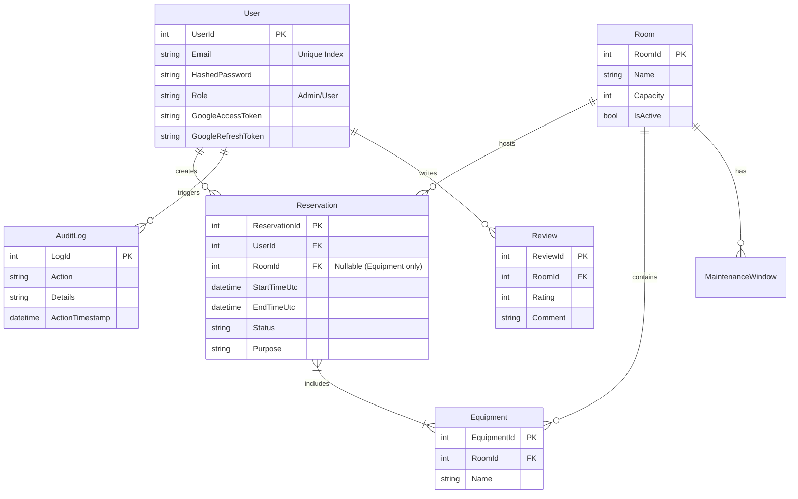
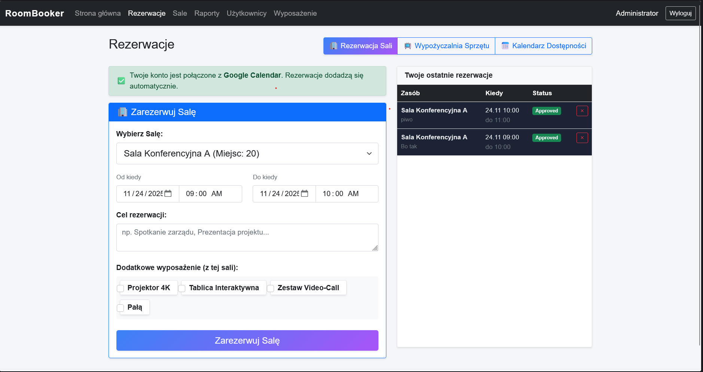
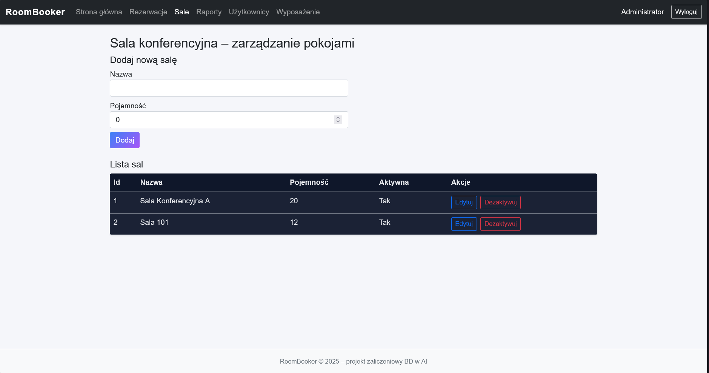

# RoomBooker - Enterprise Room & Equipment Reservation System


**RoomBooker** is a comprehensive web application developed in .NET 8, designed to streamline resource management in corporate or academic environments. It solves the critical problem of "double bookings," ensures transparency in resource availability, and automates scheduling workflows through seamless integration with **Google Calendar**.

The system supports full lifecycle management for both **Conference Rooms** and **Portable Equipment**.

---

## 1. Project Objectives & Scope

The primary goal was to engineer a complete full-stack application demonstrating advanced software architecture patterns, complex database logic, and secure integration with external APIs.

### User Roles (RBAC)
* **Administrators:** Have full control over the system. They manage resources (Rooms, Equipment), users, oversee the approval workflow, and analyze occupancy reports using SQL-powered analytics.
* **Users:** Can browse the interactive schedule, book rooms, rent equipment independently, and synchronize bookings with their private Google Calendar.

---

## 2. Technology Stack & Architecture

The solution follows **Clean Architecture** principles to ensure scalability and testability.

### Backend
* **Framework:** .NET 8 (ASP.NET Core Web API)
* **ORM:** Entity Framework Core 8 (Code First)
* **Database:** Microsoft SQL Server
* **Authentication:** JWT (JSON Web Tokens) + OAuth 2.0 (Google Integration)
* **Validation:** FluentValidation & DataAnnotations
* **Testing:** xUnit + FluentAssertions

### Frontend
* **Framework:** Blazor Server (.NET 8)
* **UI Library:** Bootstrap 5 (Responsive Design)
* **State Management:** Custom `AuthenticationStateProvider` with `ProtectedLocalStorage` persistence.

### Project Structure
1.  **`RoomBooker.Core`**: Domain Entities, Interfaces, DTOs.
2.  **`RoomBooker.Infrastructure`**: EF Core, SQL Implementations, Services (`ReservationService`, `GoogleAuthService`).
3.  **`RoomBooker.Api`**: REST API Controllers secured with `[Authorize]` attributes.
4.  **`RoomBooker.Frontend`**: Razor Components, Client-side logic.

---

## 3. Key Features

### ✅ Advanced Reservation Logic
* **Conflict Detection:** Mathematical algorithm checks for time overlaps in real-time for both Rooms and individual Equipment items.
* **Equipment Rental:** Users can book a room *with* equipment OR rent equipment independently (without a room).
* **Maintenance Windows:** Ability to block resources for maintenance.

### ✅ Google Calendar Sync (Killer Feature) 📅
* **OAuth 2.0:** Secure connection with user's Google Account.
* **Background Sync:** Approved reservations are pushed to the user's Google Calendar asynchronously using `Task.Run` to maintain UI responsiveness.
* **Resilience:** The system handles token expiration and API failures gracefully without crashing the main reservation flow.

### ✅ Data Analytics & SQL 📊
* **SQL Powered Reports:** Utilization of Stored Procedures to generate monthly statistics.
* **CSV Export:** One-click export of reports for external analysis.
* **Audit Log:** Every action (Create, Approve, Reject, Cancel) is logged via Database Triggers.

### ✅ Administration Panel
* **User Management:** Admins can manage accounts, reset passwords, and change roles.
* **Inventory Management:** Full CRUD for Rooms and Equipment.

---

## 4. Database Schema (ERD)

The application relies on a relational SQL Server database. Notably, it handles a Many-to-Many relationship between Reservations and Equipment.



---

## 5. SQL Programmability Details

The project meets advanced database requirements by implementing logic directly on the SQL Server.

### 1. Audit Trigger

Automatically logs changes in the `Reservations` table to `AuditLogs`.

```sql
CREATE OR ALTER TRIGGER trg_Reservations_Audit
ON Reservations
AFTER UPDATE, INSERT
AS
BEGIN
    SET NOCOUNT ON;
    INSERT INTO AuditLogs (EntityType, EntityId, Action, UserId, ActionTimestamp, Details)
    SELECT 
        'Reservation',
        i.ReservationId,
        CASE WHEN d.ReservationId IS NULL THEN 'Create' ELSE 'Update' END,
        i.UserId,
        GETUTCDATE(),
        CONCAT('Status: ', i.Status)
    FROM inserted i
    LEFT JOIN deleted d ON i.ReservationId = d.ReservationId
END
```

### 2. Reporting Stored Procedure & Function

Generates aggregated statistics (Total reservations & hours) for the admin dashboard using a helper scalar function.

```sql
-- Function: Calculate duration in hours
CREATE OR ALTER FUNCTION dbo.fn_GetReservationDurationHours (@Start DateTime, @End DateTime)
RETURNS INT AS 
BEGIN 
    RETURN DATEDIFF(HOUR, @Start, @End); 
END;
GO

-- Procedure: Monthly Room Statistics
CREATE OR ALTER PROCEDURE dbo.sp_GetMonthlyRoomStats @Month INT, @Year INT
AS 
BEGIN
    SELECT 
        r.Name AS RoomName, 
        COUNT(res.ReservationId) AS ReservationCount, 
        SUM(dbo.fn_GetReservationDurationHours(res.StartTimeUtc, res.EndTimeUtc)) AS TotalHours
    FROM Rooms r 
    LEFT JOIN Reservations res ON r.RoomId = res.RoomId
    WHERE MONTH(res.StartTimeUtc) = @Month AND YEAR(res.StartTimeUtc) = @Year
    GROUP BY r.Name;
END;
```

---

## 6. 📸 Application Gallery

Below are the screenshots demonstrating the key functionalities of the application.

### 🔐 Authentication & Profile
**Login & Google Connection Status**


### 📅 Reservations Module
**List View** - *Users can filter reservations and manage their bookings.*


**Room Booking Form** - *Form for booking rooms with additional equipment selection.*


**Equipment Rental Mode** - *Dedicated mode for booking specific items (e.g., projectors) without reserving a room.*


### 🛡️ Administration Panel
**Room Management (CRUD)**


**Inventory / Equipment Management**


**User Management** - *Admin can manage roles and reset passwords.*


---

## 7. Setup & Installation

### Prerequisites
* .NET 8 SDK
* SQL Server (LocalDB or Full)
* Visual Studio 2022

### Installation Steps

1.  **Database:** Update connection string in `appsettings.json` and run migrations:
    ```powershell
    cd RoomBooker.Infrastructure
    dotnet ef database update
    ```
2.  **Google Auth (Optional):** Add Client ID/Secret to `appsettings.json` in the API project.
3.  **Run:** Start both `RoomBooker.Api` and `RoomBooker.Frontend` projects via Visual Studio (Multiple Startup Projects).
4.  **Access:** Open browser at `https://localhost:7026`.

---

## 8. Author

**Name:** Arkadiusz Kowalczyk
**Student ID:** 168681
**Course:** DBwAI
**Date:** December 2025